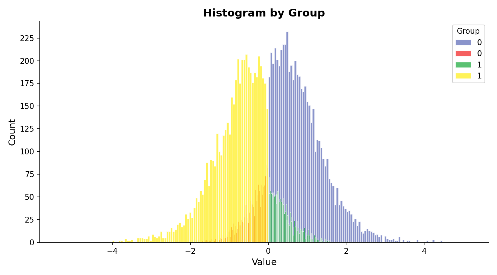
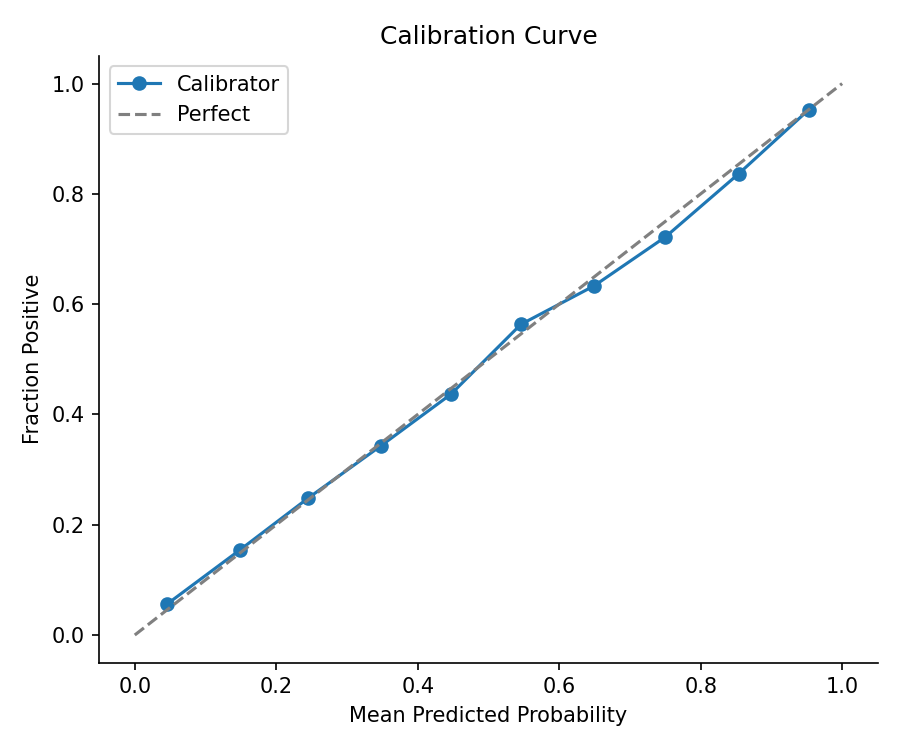

# Dota Draft Sequence and Match Outcome Predictor

Focuses only on professional matches in the ESPORTS scene of the game Dota2

Draft Sequence - Predicts Hero Draft (24 hero sequence) with up to 50%+ top-5 accuracy over each sequence slot

Match Outcome - Predicts win/loss based on engineered features based on only team hero draft, 80%+ accuracy

## Model Architecture

### Draft predictor:
- Small decoder transformer
- Vocabulary: number of heros in Dota 2
- Sequence length, 24 heros. (total of 10 heros picked and 14 heroes banned in captains mode alternating sequence)

- Current status: On Hold
  - 14,000 data points is not a lot of points to train a transformer from scratch
  - Not robust to time - the exact hero ID's picked are dependent on the current meta.
- Investigating:
  - Hero embeddings: Some heroes share similarities to roles other heroes have (e.g. Lion and Shadow Shaman provide a lot of single target lockdown)
  - The idea is that people draft based on Roles that need to be filled
  - The exact hero that fills that role is meta dependent
  - If we can embed similar roled heroes together, could lead to better prediction than attempting to predict the exact hero
  - Alternatively: Feed in meta information as cross attention to sway hero picks to conform more closely to the meta
### Match Outcome Prediction:
- Simple Logistic regression model based upon a single engineered feature: Draft Advantage
- Draft Advantage Description:
  - Assumes two teams of 5 heroes
    - Radiant: [A, B, C, D, E]
    - Dire: [1, 2, 3, 4, 5]
  - Computes two values, one per team
  - Team Synergy Advantage: Summation of - For every hero pair and ordering (i,j) , compute (% games won when i, j are on the same team) - (% games won of just hero i)
    - for all i,j within the same team
  - Counter Pick Advantage: Summation of - For every hero pair and ordering (i,j), compute (% games won when i, j are on opposing teams) - (% games own just by hero i)
    - for all i,j where i and j come from different teams
  - Final Draft advantage value: (Radiant Synergy + Radiant Counterpick) - (Dire Synergy + Dire Counterpick) as a single float
- This feature alone gives an 80% win rate prediction 
  - I also use alpha-beta prior (alpha=5, beta=5) smoothing to smooth over rare but infrequent pairings that would massively contribute to the advantage function
  - This prior smoothing essentially simulates for every event as if I had seen 5 wins and 5 losses of that rare pairing, even if I have only observed 2 wins and 0 losses, for instance
  - It brings the pair winrate significantly closer to 50/50 for rare events, but barely effects very common pairins, such as seeing a pair of heroes with 400 wins and 1000 losses.
#### Unsupervised Analaysis of Draft Advantage Custom Feature

Figure 1. Histogram of very basic match prediction. This histogram is created simply by predicting a match success as: Radiant wins if Draft Advantage > 0, Dire otherwise. This uses the entire data set (no witheld training and testing) and serves as a proof of concept. Of the 15,000 professional games in the data set, 11,000 of the 14,000 are correctly predicted as win/loss just based on our Draft Advantage Value. 
- Blue = Radiant predicted to win and radiant wins. 
- Green = Radiant predicted to win and dire wins
- Yellow = Dire predicted to win and dire wins
- Orange = Dire predicted to win and radiant wins
#### Supervised Learning using Draft Advantage Custom Feature
- Constructed a simple data set with 14,000 professional matches, and a SINGLE FEATURE: draft advantage
  - THE MOST RECENT 15% of matches are witheld for testing
  - The remaining older 85% of matches are used for training
    - Of these most recent 85% an additional 10% (of the total) is reserved for validation
- Applied very simple logistic regression on training data to train a calibrator
  - Calibrator outputs the probability of radiant winning given two team compositions
- Assessed calibrator using calibration curve analysis on testing data

Figure 2. Calibration Curve on testing data using a single custom feature + logistic regression. Very solid results
## Data

### OpenDota
- Data is collected using REST API via [OpenDota](https://www.opendota.com/).
- You can put your own API key to speed up calls by creating a "secrets" directory in the main dir
  - put your API key as a txt file within the secrets dir
- Can use OpenDota's free no API key calls, but will need to set delay to ~1.1s, longer if you are on VPN 

## Checks on Correctness:
I am very suprised the system does 80% testing accuracy on pro match games with just draft. Here are the following checks I have done to try and ensure prove the results are not bogus:

1. Leakage check. Ran the following code to see if any training data slipped into my testing data. The function returns an empty list indicating no leakage. 
def find_equal_rows(A, B):
    return [(i, j) for i, a in enumerate(A) for j, b in enumerate(B) if np.array_equal(a, b)]

out = find_equal_rows(all_data['train_x'],all_data['test_x'])